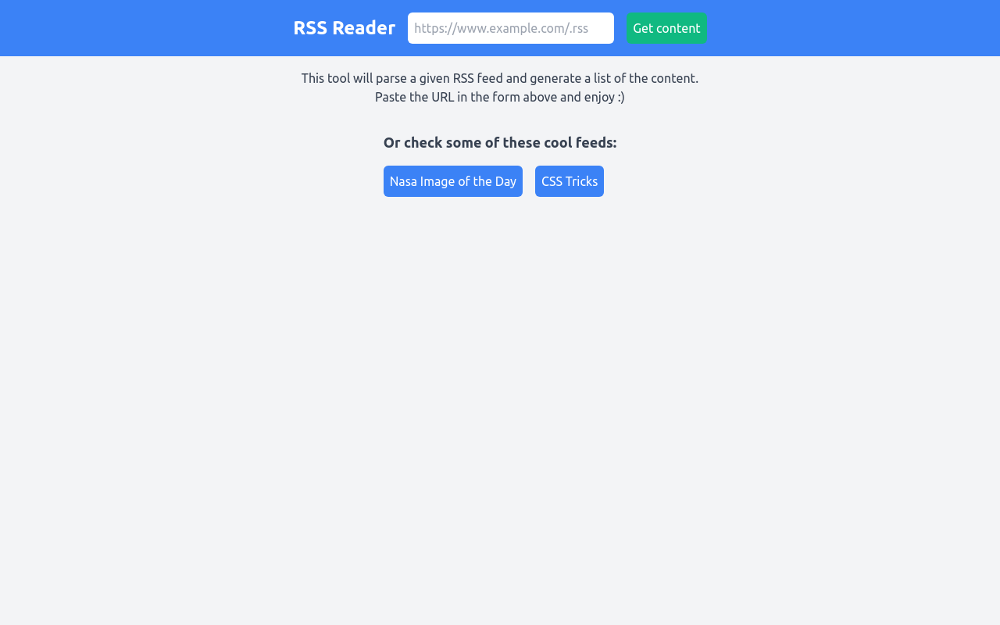

# RSS Reader

<a href="https://rss-reader-lovat.vercel.app/" target="_blank">Live demo</a>.

This is a <a href="https://www.codementor.io/projects/rss-feed-reader-website-atx32j280x" target="_blank">codementor project</a>.

## My Goals and what I've practiced

The main goal here was to create a simple and clean React app with a good visual experience. This was my first project using Tailwind and I have enjoyed a lot, it really helped me to get good results spending less time on CSS.

Working on this project also gave me the oportunity to study RSS standards.

Any feedback will be appreciated :)

### Requirements

- The user can input a RSS feed URL.
- The reader will display the title, description, and link of the original content.

### Technologies

- React
- Tailwind
- RSS Parser
- Luxon (for Dates)

#### References

- <a href="https://validator.w3.org/feed/docs/rss2.html" target="_blank">W3 RSS specification</a>
